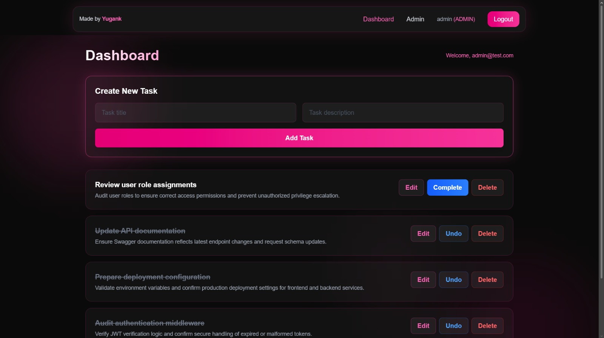
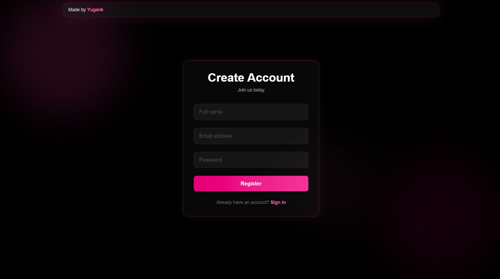

# Task Management System

A full-stack role-based task management application built using Next.js (App Router) and Express.
The system implements secure JWT authentication, role-based access control (RBAC), task isolation, and an administrative dashboard for user management.

This project demonstrates backend API design, authentication security practices, database schema management, role enforcement, production deployment handling, and real-world debugging across environments.

---

## Live Demo

Frontend  
https://task-management-system-jy7j.vercel.app/register

Backend API  
https://task-management-system-one-lake.vercel.app/

Important Notice  
This project is hosted on the Vercel free plan.  
The backend may go into sleep mode when inactive.  
The first request after inactivity may be slow due to cold start.  
Subsequent requests will be fast.

---

## Demo Credentials

Admin Account  
- Email: admin@test.com  
- Password: 123456  

User Account  
- Email: user@test.com  
- Password: 123456  

---

## Technology Stack

Frontend  
- Next.js (App Router)  
- React  
- Tailwind CSS  
- Axios  
- Client-side JWT handling  

Backend  
- Node.js  
- Express  
- JWT Authentication  
- Role-Based Access Control (RBAC)  
- Centralized Error Middleware  
- Swagger (OpenAPI Specification)  

Database  
- Neon (Serverless PostgreSQL)  
- Prisma ORM  

Deployment  
- Vercel (Frontend and Backend)  
- Neon (Database)  

---

## Core Features

Authentication and Authorization  
- User registration with hashed passwords  
- Secure login with JWT token issuance  
- /api/v1/auth/me endpoint for session validation  
- Protected routes requiring valid authentication  
- Role-based access enforcement (Admin / User)  
- Backend-enforced authorization  

Task Management  
- Create tasks  
- Update tasks  
- Delete tasks  
- Mark tasks as complete or incomplete  
- User-specific task isolation  
- Ownership validation enforced server-side  

Administrative Dashboard  
- Admin-only route protection  
- View all registered users  
- Role display and verification  
- Backend-enforced access control  

API Design  
- RESTful endpoint structure  
- API versioning (/api/v1)  
- Proper HTTP status codes  
- Centralized error handling  
- Middleware-based authentication  
- Structured JSON responses  
- OpenAPI (Swagger) specification  

---

## API Documentation

The OpenAPI (Swagger) specification file is available in the GitHub repository under:

backend/swagger.json

You can view and test the API interactively by importing the JSON file into:
https://editor.swagger.io/

The documentation includes:
- Authentication endpoints  
- Task CRUD endpoints  
- Admin user endpoints  
- Request and response schemas  
- JWT security definitions  

---

## Architecture Overview

Authentication Flow  

1. User submits login credentials.  
2. Server validates credentials.  
3. JWT is generated and returned.  
4. Token is stored in localStorage.  
5. Client sends token in the Authorization: Bearer header.  
6. Backend verifies token before granting access.  
7. Role middleware enforces admin restrictions.  

Role-Based Access Control (RBAC)  

- Each user record includes a role field.  
- Backend middleware validates role before allowing access.  
- Admin routes are enforced server-side.  
- Frontend conditionally renders admin interface only after verified role response.  
- Security does not rely solely on frontend rendering.  

---

## Database Schema

User  
- id  
- name  
- email (unique)  
- password (hashed)  
- role  

Task  
- id  
- title  
- description  
- completed  
- userId (foreign key)  

Prisma manages schema migrations and database interaction.

---

## Local Installation Guide

Backend Setup  
1. cd backend  
2. npm install  
3. Create a .env file inside the backend folder with:
   DATABASE_URL=your_neon_database_url  
   JWT_SECRET=your_secret_key  
   PORT=5000  
4. Run:
   npm start  
5. Backend runs at:
   http://localhost:5000  

Frontend Setup  
1. cd frontend  
2. npm install  
3. Create a .env.local file with:
   NEXT_PUBLIC_API_URL=http://localhost:5000/api/v1  
4. Run:
   npm run dev  
5. Frontend runs at:
   http://localhost:3000  

Important  
Make sure the backend server is running before starting the frontend.

---

## Security Considerations

- Passwords are hashed before storage  
- JWT secret stored securely in environment variables  
- Role validation enforced server-side  
- Sensitive configuration excluded from version control  
- Proper HTTP status handling and centralized error middleware  

---

## Screenshots

### Login Page  

### Dashboard  

### Admin Panel  

### Registration Page  

---

## Author

Yugank Adhikari